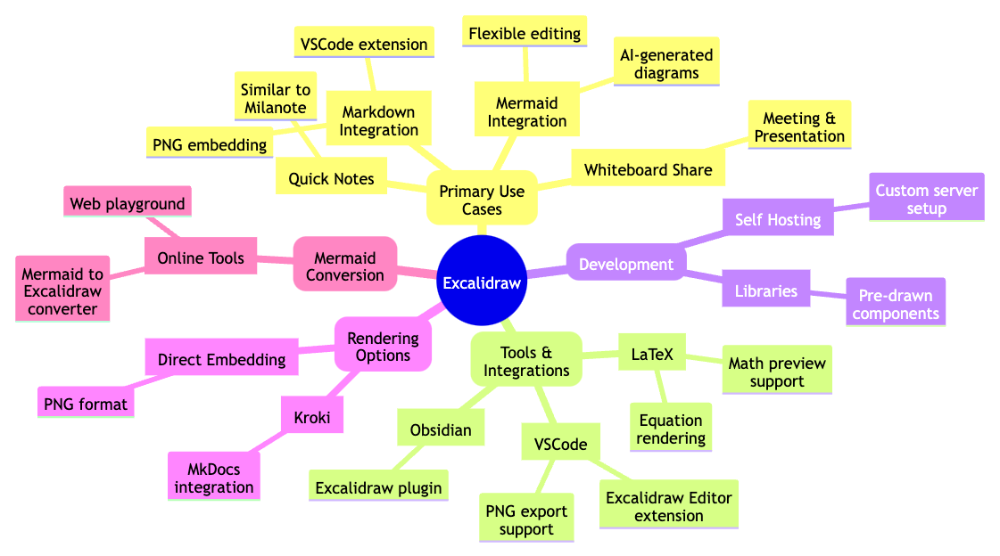
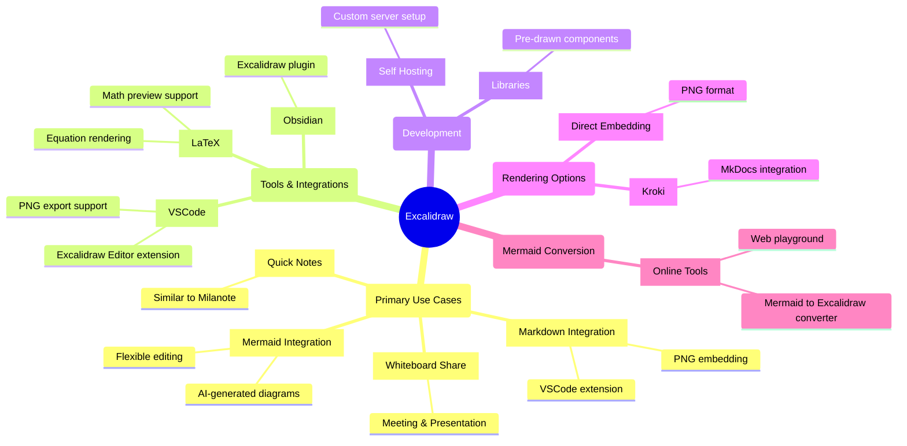

# Excalidraw Best Practice

Primary Links

- [Excalidraw](https://excalidraw.com/)
- [Excalidraw (with LaTeX)](https://math.preview.excalidraw.com/) (math preview)
- [Excalidraw+](https://plus.excalidraw.com/plus) (paid application with additional (cloud) features)
- [Exsliding](https://exsliding.sandroroth.com/) (third-party non-open-sourced)
- [Excalidraw (smart presentation)](https://excalidraw-smart-presentation.github.io/)

Use case

1. Whiteboard share session
   - Meeting & Presentation
2. Quick notes (similar to [Milanote](https://www.milanote.com/refer/rcFGaMLt9ts7hljGQX))
3. Embed chart in Markdown
   - VSCode extension + edit `*.excalidraw.png`
4. Mermaid <--> Excalidraw
   - Most of the AI can generate Mermaid quite well, convert to Excalidraw for more flexible editing
   - Prioritize Flowchart, Sequence and Class Diagrams for better support

- [Excalidraw Libraries](https://libraries.excalidraw.com/?theme=light&sort=default): store some pre-draw group components

Use Excalidraw more efficient

1. Use number hotkey to switch tools
2. Use space to move around (like the most computer drawing tools)
3. Groups components in a while
4. Use enter to add text to a shape instead of double click (which will create another text object, which cannot benefit from the alignment feature)
5. You can use iOS "Add to Home Screen" feature to make this an iOS App (and can be done similarly on Android)

## Use case in detail

### Rendering Excalidraw

- [Kroki!](https://kroki.io/)
  - [yuzutech/kroki: Creates diagrams from textual descriptions!](https://github.com/yuzutech/kroki)

Render in MkDocs

- [emilioforrer/mkdocs-project-template: Is a template that takes a code-first approach to document projects](https://github.com/emilioforrer/mkdocs-project-template)
  - [example](https://github.com/emilioforrer/mkdocs-project-template/blob/e7a78156c0605e82847690b9b89bc8eb96cad142/source/examples/kroki/index.md?plain=1#L303-L307)

### Hosting Excalidraw

Host Excalidraw server (haven't use it yet)

- [Development | Excalidraw developer docs](https://docs.excalidraw.com/docs/introduction/development)

### Excalidraw x Mermaid

> NOTE: you can convert Mermaid to Excalidraw right in the excalidraw.com now (Currently only Flowchart, Sequence and Class Diagrams are supported. The other types will be rendered as image in Excalidraw.)

- [excalidraw/mermaid-to-excalidraw: Generate Excalidraw diagrams from Mermaid](https://github.com/excalidraw/mermaid-to-excalidraw)
  - [Mermaid to Excalidraw Playground](https://mermaid-to-excalidraw.vercel.app/)

### Excalidraw in VSCode

> Equivalent of excalidraw.com (the vanilla one with no extra features)

- [Excalidraw - Visual Studio Marketplace](https://marketplace.visualstudio.com/items?itemName=pomdtr.excalidraw-editor)
- [excalidraw/excalidraw-vscode: Excalidraw for Visual Studio Code](https://github.com/excalidraw/excalidraw-vscode)
  - [Support Latex · Issue #84 · excalidraw/excalidraw-vscode](https://github.com/excalidraw/excalidraw-vscode/issues/84)

### Excalidraw x LaTeX

- [Support for writing / rendering math equations · Issue #1176 · excalidraw/excalidraw](https://github.com/excalidraw/excalidraw/issues/1176)
- [Add LaTeX rendering support · Issue #5265 · excalidraw/excalidraw](https://github.com/excalidraw/excalidraw/issues/5265#issuecomment-1438107769)

### Excalidraw in Obsidian

- [zsviczian/obsidian-excalidraw-plugin: A plugin to edit and view Excalidraw drawings in Obsidian](https://github.com/zsviczian/obsidian-excalidraw-plugin)

### Excalidraw Presentation

1. Subscribe [Excalidraw+](https://plus.excalidraw.com/)
2. [Exsliding](https://exsliding.sandroroth.com/) ([Presentation Mode · Issue #253 · excalidraw/excalidraw](https://github.com/excalidraw/excalidraw/issues/253#issuecomment-1786450778))
3. [Excalidraw Smart Presentation](https://excalidraw-smart-presentation.github.io/)
   - [excalidraw-smart-presentation/excalidraw-smart-presentation.github.io: Excalidraw fork that helps in making presentations with smart animations](https://github.com/excalidraw-smart-presentation/excalidraw-smart-presentation.github.io)
   - [How to Create Excalidraw Animations with Excalidraw Smart Presentation - DEV Community](https://dev.to/justin3go/how-to-create-excalidraw-animations-with-excalidraw-smart-presentation-3n16)
4. Use Marp: create multiple `*.excalidraw.png` => example: [Marp.md](Marp.md)
   - [Marp: Markdown Presentation Ecosystem](https://marp.app/#get-started)
   - [marp-team/marp: The entrance repository of Markdown presentation ecosystem](https://github.com/marp-team/marp?tab=readme-ov-file)
   - [marp-team/marp-cli: A CLI interface for Marp and Marpit based converters](https://github.com/marp-team/marp-cli)
     - `npx @marp-team/marp-cli@latest -w Marp.md`
